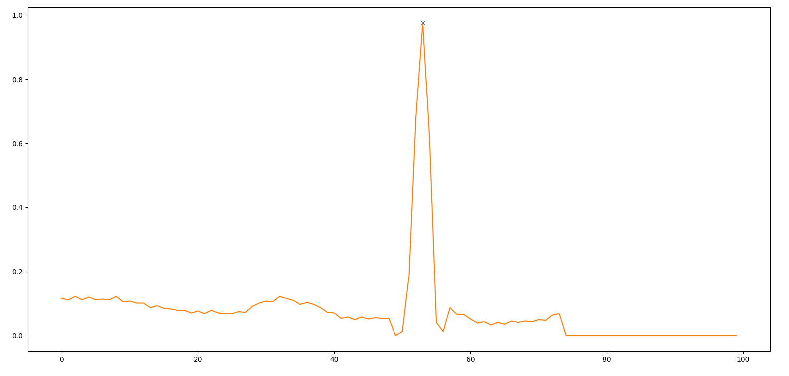

# Hearthbeat detection

This little project is a 2 hours "fun" project where I tried to implement in python a method to detect R-peaks.

## What is it all about

Basically, the goal of this project is to get the index of every R-peaks on an ECG signal. This is import for computing valuable informations like the hearth rate, the R amplitude etc ...

You can take a look at this [wikipedia link](https://en.wikipedia.org/wiki/Electrocardiography) for more details on ECG. 

## The algorithm :

The algorithm work by looking at the slope of the signal. We use the "initial max" parameter to set a threshold the slope will have to cross. This "initial max" parameter is updated every time we find a peak usign a "filter" parameter.

## Result :

## Reference :
- [data-set](https://www.kaggle.com/shayanfazeli/heartbeat/data) to play with. 
- A better implementation of the method : https://github.com/GCY/wxECGAnalyzer
- So, H. H., and K. L. Chan. "Development of QRS detection method for real-time ambulatory cardiac monitor." Engineering in Medicine and Biology Society, 1997. Proceedings of the 19th Annual International Conference of the IEEE. Vol. 1. IEEE, 1997.

